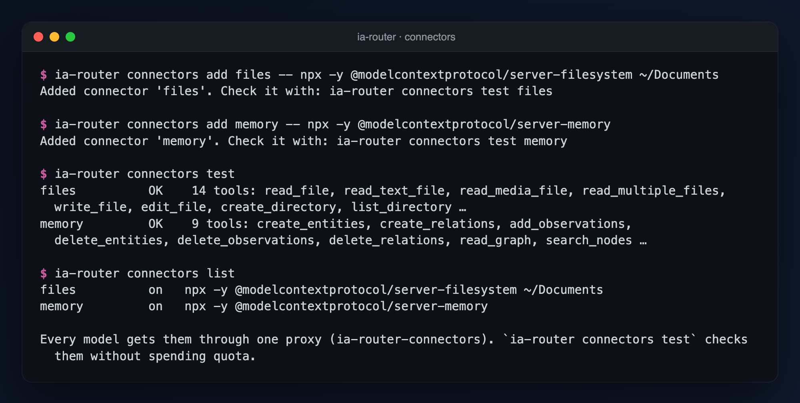

# Usage guide — ia-router

This guide explains **how to use** the router, step by step and with examples. For an overview, see the [README](../README.md). If you are an AI agent or you are going to contribute: [AGENTS.md](../AGENTS.md).

**Links:** [website](https://www.mgatc.com/en/recursos/ia-router/) · [PyPI](https://pypi.org/project/ia-router/) · [Homebrew](https://github.com/Mgobeaalcoba/homebrew-tap) · [code](https://github.com/Mgobeaalcoba/ia-suscription-router) · [changes](../CHANGELOG.md) · [issues](https://github.com/Mgobeaalcoba/ia-suscription-router/issues) · [license](../LICENSE). The website is also available [in Spanish](https://www.mgatc.com/recursos/ia-router/).

All the examples assume you are in the repo folder:

```bash
cd ~/Documents/ia-suscription-router
```

The outputs shown come from real runs (captured with claude 2.1.288, codex 0.160.0 and agy 1.2.16, and the Arena metrics of 2026-10-05). All 311 tests pass with Python 3.9 and 3.14.

---

## 1. What it is and how it works, in 30 seconds

The router **is not a model**. It decides which of your AI CLIs (`claude`, `codex`, `agy`) to send each task to, and runs it with **your subscription** to each one. And it decides with **objective metrics**, not by gut feeling.

```
your task ──► classify ──► score per model ──► pick the best ──► run its CLI
             (by rules)    (objective metrics   (with fallback    (with your login
                            + your priorities)   on rate limit)    and your quota)
```

| Concept | What it is |
|---|---|
| **Metrics** | Data published by respected portals: **Arena** (accuracy per category and price) and, if you have its free key, **Artificial Analysis** (speed, price and correct-answer benchmarks). The software **already ships with the latest Arena snapshot**: it routes with metrics from the first use. |
| **Priorities** | Optional. You answer a few questions (for code, what do you prioritize: accuracy, speed or cost?) and the routing is rebuilt with that. |
| **Models** | The official CLIs installed and logged in on your machine. They are defined in `models.json`. |

The router **never reads or copies your tokens**: each CLI uses its own login. The task classifier understands tasks written in English and in Spanish; the whole interface is in English.

---

## 2. Requirements and installation

| Requirement | How to check it |
|---|---|
| Python 3.9 or higher | `python3 --version` |
| At least one CLI installed **and logged in** (ideally all three) | See the table below |
| `curl` (comes with macOS and Linux) | To update the metrics |
| Nothing else | There are no external dependencies (standard library only) |

| CLI | Installation | Login |
|---|---|---|
| `claude` (Claude Code) | See the Claude Code documentation | Run `claude` once and follow the login |
| `codex` (OpenAI) | See the Codex CLI documentation | Run `codex` once and follow the login |
| `agy` (Google Antigravity) | `brew install --cask antigravity-cli` | Run `agy` **with no arguments** in a terminal and choose to sign in with Google |

> **Gemini CLI is no longer used.** Google discontinued it for individual accounts (login fails with *"This client is no longer supported"*). Its replacement is `agy`.

You do not need to install all three, but the router splits work among the ones you have.

**Installing the router.** Two options; pick one (Python 3.9 or higher):

#### Option A · Homebrew (macOS)

```bash
brew install Mgobeaalcoba/tap/ia-router
```

It is equivalent to `brew tap Mgobeaalcoba/tap && brew install ia-router`. Homebrew installs Python if needed.

#### Option B · pip or pipx (any system with Python 3.9+)

```bash
pipx install ia-router                  # recommended: installs it isolated and puts the `ia-router` command on your PATH
python3 -m pip install --user ia-router # alternative with pip
```

If you do not have `pipx`: `brew install pipx && pipx ensurepath` (macOS) or `python3 -m pip install --user pipx && python3 -m pipx ensurepath`. Then open a new terminal.

#### Check that it worked

```bash
ia-router --version     # ia-router 0.4.0
ia-router doctor        # which CLIs you have installed and which model each one uses (spends no quota)
```

You need **at least one** of the official CLIs installed and logged in (`claude`, `codex` or `agy`); the router does not install them for you.

#### Update and uninstall

| | Homebrew | pipx | pip |
|---|---|---|---|
| Update | `brew upgrade ia-router` | `pipx upgrade ia-router` | `python3 -m pip install -U ia-router` |
| Uninstall | `brew uninstall ia-router` | `pipx uninstall ia-router` | `python3 -m pip uninstall ia-router` |

Uninstalling **does not delete your data** (`~/.ia-router`: downloaded metrics, priorities, history). To start from scratch: `rm -r ~/.ia-router`.

If `ia-router: command not found` shows up after installing with pip or pipx, the scripts directory is missing from your `PATH` (usually `~/.local/bin`): run `pipx ensurepath` and open a new terminal.

**From a clone of the repo** (to contribute or try changes):

```bash
git clone https://github.com/Mgobeaalcoba/ia-suscription-router.git ~/Documents/ia-suscription-router
cd ~/Documents/ia-suscription-router
python3 -m unittest discover -s tests    # optional: it must end in OK
python3 cli.py                           # equivalent to `ia-router`
cp .env.example .env                     # optional: to turn on speed and cost (see 4.2)
```

When installed with pip or brew, the `.env` goes in `~/.ia-router/.env` (there is no repo folder). If you want to change the models or their commands, copy `ia_router/data/models.json` to `~/.ia-router/models.json`: that copy takes priority over the bundled one and **survives updates** (see 8.2).

---

## 3. Chat mode (the recommended way to use it)

```bash
ia-router      # or: python3 cli.py
```

### First open: onboarding

On the first open the chat checks which of the three official CLIs are installed. If everything is there it says nothing. If something is missing you get the exact step for each one, for example:

```
Welcome to ia-router. It routes your tasks across the official AI CLIs you already pay for. Here is where you stand:
  ✔ claude       installed (login not checked)
  ✗ codex        not installed
  ✗ antigravity  not installed
  codex: Install the Codex CLI (see its documentation). Run `codex` once and follow the login.
  antigravity: Install it with `brew install --cask antigravity-cli`. Run `agy` with no arguments in a terminal and choose to sign in with Google.
With only one model ready everything goes to it: the router has nothing to choose between. It works; add another CLI whenever you want the split.
```

- **Nothing installed:** it says tasks cannot run yet and shows this again on every start until at least one CLI is there.
- **Only one CLI:** it works, and everything goes to that model.
- **Installed but logged out:** the router does not check logins on its own (that costs a query per CLI). Run `/setup` (or `ia-router setup`) and accept the optional login check, or just use it: a task that fails for lack of login tells you which CLI and how to log in, and the next start reminds you.
- **The router never installs a CLI or logs in for you**: that would mean handling their credentials. It tells you the step and checks again.

### What happens on startup

The header shows where the metrics that drive the routing come from:

```
 ●─╮     ╦╔═╗   ╦═╗╔═╗╦ ╦╔╦╗╔═╗╦═╗
 ●─┼─◉   ║╠═╣ ─ ╠╦╝║ ║║ ║ ║ ║╣ ╠╦╝  v0.4.0
 ●─╯     ╩╩ ╩   ╩╚═╚═╝╚═╝ ╩ ╚═╝╩╚═  your AI subscriptions, routed

 ╭──────────────────────────────────────────────────────────────────────────╮
 │ metrics  Arena 2026-10-05 (bundled)                                      │
 │ models   ● claude   ● codex   ● antigravity                              │
 │ folder   ~/Documents/ia-suscription-router                               │
 ╰──────────────────────────────────────────── by Mgobeaalcoba · mgatc.com ─╯
```

Then the chat resolves **three things, and it always asks before spending anything**:

1. **Which model does each CLI use?** The metrics are about *models* (for example `claude-sonnet-5-5`), not CLIs. The first time it offers a minimal query to each CLI to find out (about 12k input tokens on codex and agy, few on claude). Afterwards it learns it on its own from every normal answer.
2. **Are the metrics up to date?** If they are more than 7 days old, it tells you and offers to update them (once a day at most). See 4.5.
3. **Do you want to adjust the priorities?** Only once, and only if there is something to prioritize (speed or cost; see 4.4). By default it answers no; afterwards there is `/priorities`.

### The input box and files

What you type goes in a box with a gradient border (like those of Claude Code, Codex and Antigravity), with a hint text when it is empty and, below, the shortcuts and the metrics date. At the top right of the border you see the model: `auto` or the one you pinned with `/model`.

```
╭──────────────────────────────────────────────────────────────────── auto ─╮
│ ❯ "/Users/you/Photos/screenshot.png" what error does it show?             │
╰────────────────────────────────────────────────────────────────────────────╯
  ⎘ screenshot.png · image · 212.3 KB
  ⏎ send · ⌥⏎ or \⏎ new line · / commands · ⌃D quit              metrics 2026-10-05
```

**Files: drag them onto the terminal.** The terminal pastes the path and the router cleans it up (absolute, quoted if it has spaces) and highlights it if the file exists; below, each attachment appears with its type and size. Typing or pasting a path also works (`/path/file`, `~/file`, `./file`, `file://…`). On send:

| Type | What happens |
|---|---|
| Text and code (`.txt`, `.md`, `.py`, `.csv`, `.json`… or any UTF-8 file up to 200 KB) | Its content is appended to the task as context; it works for any model. |
| Images, PDFs, binaries and folders | The path is passed and the model opens it (Claude gets access to that folder with `--add-dir`; Codex reads it from its read-only sandbox). The task adds the `multimodal` category if there is an image or PDF. |

**Antigravity cannot open files in non-interactive mode** (it asks for a permission it cannot ask for), so with non-text attachments the router drops it from the routing (`models.json`: `"reads_files": false`). If you pinned it with `/model antigravity`, it warns you instead of failing.

**Editing.** Arrows, `Home`/`End` (or `Ctrl-A`/`Ctrl-E`), `Alt-←/→` to jump words, `Ctrl-W` deletes the word, `Ctrl-U` up to the start of the line, `Ctrl-K` to the end. **Multiple lines:** `Alt-Enter`, `Ctrl-J` or `\` + Enter; pasted text with line breaks is respected. **History:** `↑`/`↓` (saved between sessions in `~/.ia-router/history.jsonl`). **Commands:** when you type `/` the filtered list appears; `Tab` or Enter complete, `↑`/`↓` choose. **Quit:** `Ctrl-D` with the box empty, `Ctrl-C` twice, or `/exit`. `Ctrl-C` with text clears it.

If there is no terminal (pipe, `TERM=dumb`) or it has fewer than 40 columns, the simple `ia> ` prompt is used and everything else works the same.

### `/` shortcuts

They always work. When you type `/` the filtered list appears.

| Shortcut | What it does |
|---|---|
| `/setup` | Which CLIs are installed and logged in, and what to do about the missing ones (it can check the logins: one minimal query each, asked first). |
| `/models` · `/models probe` | Status of the CLIs and **which model each one uses**; with `probe`, a real minimal query (login, latency; spends a pinch of quota). |
| `/scores [category]` | Score per model and category; with a category, the weight × value breakdown. |
| `/metrics` · `/metrics refresh` | Where the data comes from and which entry of each portal each model was matched with; with `refresh`, it updates them showing every step (`force` = even if recent). |
| `/priorities` | Questions: what you prioritize for each kind of task (accuracy, speed or cost). |
| `/model codex` · `/model auto` | Pin a model for everything that follows, or go back to automatic routing. |
| `/stats` | Success, latency and tokens per model. |
| `/connectors [on\|off]` | MCP connectors (Gmail, Calendar…) the models can use; see section 6. |
| `/explain on\|off` | Show the routing table on every message. |
| `/md on\|off` | Rendered markdown (like a README on GitHub, without markup characters) or raw text. Without a terminal (pipe) or with `NO_COLOR` it is shown raw. |
| `/ask text` | Force the interpretation as a task. |
| `/clear` | Forget the conversation (the chat remembers the last 6 turns). |
| `/help` · `/exit` | Help · quit (also `exit`, Ctrl-D). |

It also understands queries in natural language ("show me the stats", "which models do I have", "how does the router decide"). Everything else is a task and gets routed. `Ctrl-C` during a task interrupts it without closing the program.

### Standalone commands (without opening the chat)

Everything in the chat also exists as commands for scripts (`setup`, `ask`, `route`, `scores`, `metrics`, `priorities`, `doctor`, `stats`, `connectors`). They are described in section 5.

---

## 4. Routing by objective metrics

### 4.1 Where the data comes from

| Source | What it provides | Access |
|---|---|---|
| **[Arena](https://arena.ai/leaderboard)** | **Accuracy**: Elo per category (human preference in blind comparisons, with style control and margin of error): coding, hard_prompts, expert, math, creative_writing, instruction_following, longer_query and the vision, search and webdev arenas. Also the **price** per million tokens, when it publishes it. | Public pages of `arena.ai/leaderboard` (its `robots.txt` allows them). It is the same data as the official `lmarena-ai/leaderboard-dataset` dataset (CC BY 4.0). No key. |
| **[Artificial Analysis](https://artificialanalysis.ai/)** | **Speed** (tokens/s), **price** and correct-answer benchmarks (coding and math indexes, GPQA, HLE…). | API with a **free key** (see 4.2). Optional. |

**The software ships with the latest Arena snapshot** (`ia_router/data/arena.json`, 323 KB), so it needs no network to route with metrics. When you update (4.5), a newer one is saved to `~/.ia-router/metrics.json` and **the most recent of the two always applies**. Nothing is queried on its own: updating is your action.

### 4.2 Turn on Artificial Analysis (speed and cost)

Arena does not measure speed, and it does not publish the price of every model (for example, that of `gpt-6.1-sol`). With the Artificial Analysis key, **speed and cost** are added, which are the dimensions you can prioritize in `/priorities`. Without it, the routing uses accuracy only.

1. Create a free account at [artificialanalysis.ai](https://artificialanalysis.ai/) and generate an **API key** (free plan: 1,000 requests per day).
2. Copy the example file and paste your key, without quotes or spaces:

   ```bash
   cp .env.example .env
   # edit .env:  ARTIFICIAL_ANALYSIS_API_KEY=your_key
   ```

3. Update the metrics: `python3 cli.py metrics refresh` (or `/metrics refresh` in the chat). You will see the line `Artificial Analysis: N models` and `/metrics` will show which entry each model was matched with.

**The `.env` is never pushed to git** (it is in `.gitignore`); what is versioned is `.env.example`. A variable already defined in your environment (`export ARTIFICIAL_ANALYSIS_API_KEY=…`) takes priority over the file. The router looks for `.env` in the repo folder and in `~/.ia-router/.env`. The key travels to `curl` through standard input, **never through the command line**, and it is not stored anywhere else. Artificial Analysis asks for attribution: the router shows it every time it uses its data.

### 4.3 How the score is computed

```
score(model, category) = Σ weight × value        (values from 0 to 10, relative to YOUR models)
```

| Dimension | Value |
|---|---|
| **Accuracy** | Arena Elo in the category (average of the Arena categories that correspond to it, see 4.6) and, if there is a key, the Artificial Analysis index. **10 = ties or beats the best of your models**; 100 Elo points of difference ≈ 7.2. **Differences within the margin of error reward nobody.** |
| **Speed** | Tokens per second published by Artificial Analysis. |
| **Cost** | List price per million tokens (3 input : 1 output; Artificial Analysis or, if it covers everyone, Arena). It is a **proxy for quota consumption**: with a subscription you do not pay per token, but the more expensive the model, the faster it runs out. |

Speed and cost use a **logarithmic scale**: 10 for the best of your models and **2 points less every time another is twice as slow or as expensive**. (With a proportional scale the cheap model would win even with "accuracy" as the priority, because Elo is very compressed: we tested it and this scale fixes exactly that.)

Rules to avoid fooling yourself:

- **Matching is by the real model** each CLI uses (the one learned on use or with `probe`) and by its **effort level**. Arena publishes variants (`-high`, `-xhigh`, `-max`); the matching one is chosen and, if it does not exist, the closest, marked with ⚠ **approximate** in `/metrics`: your CLI may run with a different effort than the leaderboard's.
- **A dimension only counts if there is data for ALL your models.** If one is missing (for example one model's price), that dimension **carries no weight** and the weights are shared among those that do have it: scales are never mixed.
- If Arena does not cover a category for all your models, **the accuracy of that category is the `models.json` estimate**, marked with `e` in `/scores`. It is the last resort.
- If the router does not yet know which model each CLI uses, the `models.json` estimate applies entirely.

### 4.4 Your priorities: `/priorities`

Six multiple-choice steps with a selector (↑/↓ or the number, Enter confirms, Esc cancels; each answer is left summarized in one line), one per kind of task: **code and debugging**, **writing and drafting**, **analysis, data and research**, **math** and **quick tasks**; the last one is the confirmation. The options are:

| Option | Weights (accuracy / speed / cost) | When it is offered |
|---|---|---|
| **Accuracy** | 0.80 / 0.10 / 0.10 | always |
| **Balanced** | 0.50 / 0.25 / 0.25 | always |
| **Speed** | 0.40 / 0.50 / 0.10 | only with speed data for **all** your models |
| **Cost** | 0.40 / 0.10 / 0.50 | only with price data for **all** your models |

Without answers, default weights apply: 0.70 / 0.15 / 0.15 (and 0.40 / 0.50 / 0.10 for quick tasks). If there is no speed or cost data, **there is nothing to prioritize** and `/priorities` explains it instead of asking useless questions. At the end it shows how the routing looks (which model it picks for each category) and lets you **Save** or **Discard**. It is saved in `~/.ia-router/profile.json`, previous answers appear preselected, and **the change takes effect immediately**: there is nothing to "regenerate".

### 4.5 Updating the metrics, with visibility

```bash
python3 cli.py metrics refresh      # or /metrics refresh in the chat
```

It shows every step, and at the end **what changed in the routing**. Real output, with the metrics bundled the same day (that is why nothing changes):

```
Reading the arena.ai leaderboards (one page per category, ~11 requests of 2-3 MB, about a minute)…
Arena · search/overall: 34 models
Arena · text/coding: 408 models
…
Arena · webdev/overall: 138 models
Artificial Analysis: no key (optional, brings speed). See .env.example.
Metrics up to date: Arena 2026-10-05 (updated)
The routing does not change with this data.
```

When something changes, instead of the last line it lists each difference, in this format:

```
What changed in the routing:
  · <category>: now picks <model> (was <model>)  [<model> <before>→<now>]
  · <category>: <model> <before>→<now>        (moves of 0.3 points or more)
```

(If it fails, it tells you and continues with the metrics you had.) About 11 arena.ai pages are read, one at a time and with a pause, with retries on rate limiting: **about a minute**. The data is cached: if yours is less than 12 hours old it does not request it again (`--force` to insist). If the site changes the format of its pages, it reports a clear error and everything continues with what you had.

### 4.6 What each category looks at

| Router category | Arena | Artificial Analysis (correct-answer benchmarks) |
|---|---|---|
| `general` | text/overall | intelligence index |
| `coding` | text/coding + webdev | coding index, `scicode`, `terminalbench_v4_0` |
| `debugging` | text/coding + hard_prompts | coding index, `terminalbench_v4_0` |
| `writing` | creative_writing + instruction_following | `ifbench` |
| `analysis` | hard_prompts + expert | intelligence index, `hle` |
| `data` | math + coding | coding and math indexes |
| `math` | text/math | math index, `aime_25` |
| `research` | search arena | intelligence index |
| `long_context` | longer_query | `lcr` (long-context reasoning) |
| `multimodal` | vision arena | — |
| `quick` | text/overall | — (speed weighs in) |

**A benchmark only counts if all your models have it.** The real Artificial Analysis API does not publish every index for every model (for example, for `claude-sonnet-5-5`, `gpt-6.1-sol` and `Gemini 3.8 Flash` the coding and math indexes are missing), so each category has several candidates and the ones that cover everyone are used. Benchmarks are compared against the best of your models (`10 × value / best`).

If a category has data from both sources, they are averaged.

**What it is NOT.** Arena measures **human preference**, not whether the answer is correct, and the data is about generic models, not your CLI with its tools. The Artificial Analysis benchmarks do have a correct answer, which is why they are added when there is a key. The date shown is the query date (the pages do not publish the snapshot's).

---

## 5. The commands, with examples

### 5.1 `scores` — what the router picks and why

```bash
python3 cli.py scores [category]
```

```
category              claude         codex   antigravity
────────────────────────────────────────────────────────
coding                 9.5           10.0*           7.8
debugging              9.9           10.0*          10.0*
writing                9.7            9.8           10.0*
analysis               9.9           10.0*           9.8
data                  10.0*          10.0*          10.0*
research               7.0 e          6.0 e          8.0*e
math                   7.0 e          8.0*e          8.0*e
multimodal             9.7           10.0*          10.0*
long_context           9.8            9.9           10.0*
quick                  9.5            9.8           10.0*

* = the one the router picks · e = hand-estimated accuracy (Arena does not cover that category for all your models)
Dimensions with data: accuracy  ·  speed: your Artificial Analysis key is missing (.env)
Data: Arena 2026-10-05 (bundled)  ·  Attribution: Arena (arena.ai), leaderboard-dataset dataset, CC BY 4.0
```

**With Artificial Analysis active** (speed and cost add to the score), real output with your three models:

```
category              claude         codex   antigravity
────────────────────────────────────────────────────────
coding                 8.2            8.8*           8.2   
debugging              8.2            8.9*           8.6   
writing                8.9            8.8           10.0*  
analysis               8.5            8.9            9.6*  
data                   9.2            8.9           10.0*  
research               8.1            8.9            9.0*  
math                   7.0 e          7.5 e          8.6*e 
multimodal             8.9            8.9           10.0*  
long_context           8.8            8.9            9.9*  
quick                  8.1            7.4           10.0*  

* = the one the router picks · e = hand-estimated accuracy (Arena does not cover that category for all your models)
Dimensions with data: accuracy, speed, cost
Data: Arena 2026-10-05 (updated) · Artificial Analysis 2026-10-05  ·  Attribution: Arena (arena.ai), leaderboard-dataset dataset, CC BY 4.0 · Artificial Analysis (artificialanalysis.ai)
```

And the breakdown of a category, with the sources of each dimension:

```
* = the one the router picks · e = hand-estimated accuracy (Arena does not cover that category for all your models)
Dimensions with data: accuracy, speed, cost
Data: Arena 2026-10-05 (updated) · Artificial Analysis 2026-10-05  ·  Attribution: Arena (arena.ai), leaderboard-dataset dataset, CC BY 4.0 · Artificial Analysis (artificialanalysis.ai)

Score of «coding» = Σ weight × value (0-10)
claude       =  8.21   accuracy 8.7×0.70  speed 7.2×0.15  cost 7.2×0.15
               accuracy: Arena text/coding 1536; Arena webdev/overall 1715; AA scicode 0.529; AA terminalbench_v4_0 0.298 · speed: AA 89 tok/s · cost: AA $4.00/M tokens
codex        =  8.79   accuracy 9.8×0.70  speed 5.5×0.15  cost 7.2×0.15
               accuracy: Arena text/coding 1542; Arena webdev/overall 1758; AA scicode 0.532; AA terminalbench_v4_0 0.48 · speed: AA 49 tok/s · cost: AA $4.00/M tokens
antigravity  =  8.19   accuracy 7.4×0.70  speed 10.0×0.15  cost 10.0×0.15
               accuracy: Arena text/coding 1530; Arena webdev/overall 1583; AA scicode 0.566; AA terminalbench_v4_0 0.197 · speed: AA 238 tok/s · cost: AA $1.50/M tokens
```

With a category (`scores coding`) it adds the breakdown: each model with its values, weights and sources (`accuracy: Arena text/coding 1536; Arena webdev/overall 1715`).

### 5.2 `metrics` — where the data comes from

```bash
python3 cli.py metrics            # which entry of each portal was matched with each model
python3 cli.py metrics refresh    # update (see 4.5); --force even if you have recent data
```

```
Metrics: Arena 2026-10-05 (bundled)  ·  Arena bundled with this version

claude       CLI model: claude-sonnet-5-5
             Arena → claude-sonnet-5.5-xhigh  ⚠ Arena does not publish the same effort level your CLI uses: approximate data (text: xhigh, vision: xhigh, webdev: high)
codex        CLI model: gpt-6.1-sol
             Arena → gpt-6.1-sol-max  ⚠ Arena does not publish the same effort level your CLI uses: approximate data (text: max, vision: max, webdev: max)
antigravity  CLI model: Gemini 3.8 Flash (High)
             Arena → gemini-3.8-flash-high

Artificial Analysis is not active: without its key there is no speed nor, in general, cost. See .env.example.
Sources: Arena (arena.ai), leaderboard-dataset dataset, CC BY 4.0
```

### 5.3 `priorities` — what you prioritize

```bash
python3 cli.py priorities
```

It requires an interactive terminal (it uses the arrow-key selector). See 4.4.

### 5.4 `ask` and `route` — route and run

```bash
python3 cli.py ask "TASK" [-m MODEL] [-c FILE]... [--dry-run]
python3 cli.py route "TASK" [-c FILE]...
```

| Option | Effect |
|---|---|
| `-m`, `--model` | `auto` (default) or force `claude` / `codex` / `antigravity`. |
| `-c`, `--context` | Adds a file as context. It can be repeated. |
| `--dry-run` | Shows the decision and the attempt order, **without running** anything (spends no quota). `route` is the same, shorter. |

```bash
python3 cli.py ask "Write a Python function that sums a list" --dry-run
```

```
Classification (rules, metrics: yes): coding×2
model    score  status
codex     10.0  OK             coding×2→10.0
claude    9.54  OK             coding×2→9.54
antigravity  7.78  OK             coding×2→7.78
→ chosen: codex
(dry-run) attempt order: ['codex', 'claude', 'antigravity']
```

**What the answer shows.** A header with the provider, the **exact model** that answered and the input **tokens** (with what came from cache in parentheses) and output tokens, and then the text with rendered markdown:

```
[claude (claude-sonnet-5-5) · in 16.5k (8.4k cached) · out 72]
```

If the CLI does not report the model or the tokens, `tokens n/a` is shown.

**Automatic fallback.** If the chosen model fails, it tries the next one (at most 3 attempts):

| Situation | What the router does |
|---|---|
| Rate limit (quota exhausted) | Puts that model in *cooldown* for 30 min and tries the next one. |
| No login | Puts that model in cooldown for 60 min and tries the next one. |
| Timeout or other error | Tries the next one. |

**Exit code:** `0` if there was an answer, `1` if all attempts failed, `2` if you asked for a model that does not exist.

### 5.5 `doctor` — diagnostics

```bash
python3 cli.py doctor            # spends no quota
python3 cli.py doctor --probe    # real minimal query to each CLI: login, latency, version and model
```

```
Config: 3 models | state in: ~/.ia-router | metrics: Arena 2026-10-05 (bundled)

claude       installed     cooldown=0s  model: claude-sonnet-5-5
codex        installed     cooldown=0s  model: gpt-6.1-sol
antigravity  installed     cooldown=0s  model: Gemini 3.8 Flash (High)
```

### 5.6 `stats` and `reset-cooldowns`

```bash
python3 cli.py stats
```

```
model            runs success   avg secs rate limits  auth  tokens in tokens out
claude              5    100%        6.1           0     0      11391        156
antigravity         3    100%        8.9           0     0          0          0
codex               4    100%       60.5           0     0     454613       5960
```

It comes from the local log (`~/.ia-router/log.jsonl`). The log **does not store your prompts**, only model, **real model id**, tokens, success, duration and errors. Input tokens include what came from cache; runs from before token tracking existed (like the `antigravity` ones here) add up to 0.

If a model ended up in cooldown and you already fixed it (you logged in again, or the quota limit passed): `python3 cli.py reset-cooldowns`.

---

## 6. Connectors: let the models use your other apps

Connectors give **any** model (claude, codex, agy) access to other apps through [MCP](https://modelcontextprotocol.io) servers: Gmail, Calendar, Drive, Slack, GitHub, a CRM, your own tools. You register a server once; from then on every task can use it.

```
claude / codex / agy ──► ia-router connectors serve (one proxy) ──► gmail server
                                                                 ├─► calendar server
                                                                 └─► your CRM (http)
```

The router runs **one proxy MCP server** that starts all your enabled connectors and exposes their tools as `<connector>__<tool>` (for example `gmail__search_messages`). Each CLI is pointed at that single proxy, so permissions, logging and credentials live in one place and it behaves the same with every model.

### 6.1 Add a connector

```bash
# a local server, started with a command (the usual case: npx, uvx, docker…)
ia-router connectors add gmail --env GMAIL_TOKEN='${GMAIL_TOKEN}' -- npx -y @your/gmail-mcp-server

# a remote server (Streamable HTTP) with a static header
ia-router connectors add crm --url https://crm.example.com/mcp --header 'Authorization: Bearer ${CRM_KEY}'

ia-router connectors test        # starts each one and lists its tools; spends no model quota
ia-router connectors list
```



Names are lowercase letters, digits and hyphens. Everything after `--` is the command, options included. The router does not ship a catalog: use the MCP server of the app you want (its own documentation says how to start it and how to log in).

**Credentials.** The router never handles OAuth tokens: each MCP server does its own login (many open a browser the first time, or read a token you give them). When a server needs a key, reference it as `${NAME}`: it is resolved from your environment or from your `.env` when the server starts, so the key never lands in the registry. If you type a literal value, the router warns you; the registry (`~/.ia-router/connectors.json`) is created readable only by you.

### 6.2 How each CLI gets them

| CLI | How |
|---|---|
| `claude` | On every call the router adds `--mcp-config` with the proxy and `--allowedTools mcp__ia-router-connectors`: only that server is pre-approved, never a blanket "allow everything". |
| `codex` | On every call the router adds `-c mcp_servers.ia-router-connectors.…` overrides, including `default_tools_approval_mode="approve"` for that server only. Your `~/.codex/config.toml` is not touched. |
| `agy` | Antigravity has no per-call option, so register the proxy once: `ia-router connectors install agy` (undo with `uninstall agy`). It runs `agy mcp add …` and adds the allow rule `mcp(ia-router-connectors/*)` under `permissions.allow` in `~/.gemini/antigravity-cli/settings.json`: without it agy's non-interactive mode auto-denies MCP tools. The rule covers only this proxy, and `uninstall` removes it. |

A custom `ROUTER_CMD_<MODEL>` command is respected as is: connectors are not injected into it.

### 6.3 Using them

- **Chat:** connectors are on automatically when at least one enabled connector is registered. `/connectors` lists them; `/connectors off` / `/connectors on` switches them for the session.
- **One-off commands:** `ia-router ask "…"` uses them; add `--no-connectors` to skip them for that task.
- **Cost:** every connector you enable adds its tool descriptions to each call (a few thousand tokens for a big server) and the time to start it. Disable the ones you do not use daily: `ia-router connectors disable NAME`.

Example, in the chat: `ia ❯ summarize the unread emails from today and put a 30-minute focus block on my calendar`.

### 6.4 Permissions and safety

- **Connectors can read and write.** If a server offers a "send email" tool, a model can send an email when you ask it to. To hide tools, add an `allow` (only these) or `deny` (never these) list of the server's own tool names in `~/.ia-router/connectors.json`:

  ```json
  { "servers": { "gmail": { "command": ["npx", "-y", "@your/gmail-mcp-server"], "deny": ["send_email", "delete_message"] } } }
  ```

- **Prompt injection is real.** A model that reads an email or a web page can be told to do things by that content. Keep `deny` lists on destructive tools and prefer `/connectors off` for tasks that read untrusted text.
- **Audit log:** every tool call is recorded in `~/.ia-router/connectors.log.jsonl` with the server, the tool, success and duration. Arguments and results are never logged.
- A failing connector is skipped and reported on stderr; the rest keep working.

---

## 6b. Using the router from Claude Code (MCP)

It lets Claude delegate subtasks to the other models within a conversation.

**Register the server** (only once):

```bash
claude mcp add ia-router -- python3 ~/Documents/ia-suscription-router/cli.py mcp
```

**Tools Claude will see:**

| Tool | What it does |
|---|---|
| `route_task` | Decides which model suits best, without running. Returns the ranking with reasons. |
| `ask_model` | Runs a task on another model. `model` can be `auto` or a specific model. It accepts `context_files` and `timeout_seconds`. |
| `list_models` | Lists models, whether they are installed and whether they are in cooldown. |

**Example prompts for Claude Code:**

> *"Ask Antigravity to summarize these 3 files and Codex to review the bug; combine both answers."*

> *"Use `route_task` to tell me which model suits best for migrating this database."*

> *"Show me with `list_models` which ones are available."*

The MCP server **uses the same metrics-based routing** as the CLI. If tasks take a long time, raise the MCP tool timeout of your client (the `MCP_TOOL_TIMEOUT` variable in Claude Code).

---

## 7. Where everything is stored

| What | Where |
|---|---|
| Arena snapshot bundled with the software | `ia_router/data/arena.json` (in the repo) |
| Metrics you downloaded (Arena and Artificial Analysis) | `~/.ia-router/metrics.json` |
| Your priorities (`/priorities`) | `~/.ia-router/profile.json` |
| Which model each CLI uses (learned) | `~/.ia-router/models_seen.json` |
| When you were offered an update / the questions | `~/.ia-router/startup.json` |
| Cooldowns | `~/.ia-router/state.json` |
| Run log (no prompts; with model and tokens) | `~/.ia-router/log.jsonl` |
| History of what you type in the input box | `~/.ia-router/history.jsonl` |
| Your MCP connectors (can hold keys: readable only by you) | `~/.ia-router/connectors.json` |
| Connector tool-call log (no arguments or results) | `~/.ia-router/connectors.log.jsonl` |
| Your Artificial Analysis key | `~/.ia-router/.env` (or `.env` in the clone folder, ignored by git) or the environment variable |
| Models, commands and timeouts | `ia_router/data/models.json` (bundled) or your copy in `~/.ia-router/models.json` |

To start from scratch: `rm -r ~/.ia-router`. To repeat only one part, delete that file (for example `profile.json` goes back to the default weights).

**If you come from an earlier version** (with a manifest and `calibrate`): `manifest.json`, `manifest.prev.json`, `external.json` and the old `metrics.json` data are no longer used. `metrics.json` is replaced on its own the first time you update; you can delete the others.

---

## 8. Advanced configuration

### 8.1 Environment variables

| Variable | Effect | Example |
|---|---|---|
| `ARTIFICIAL_ANALYSIS_API_KEY` | Free Artificial Analysis key (speed, cost, benchmarks). Best in `.env` (see 4.2). | `.env`: `ARTIFICIAL_ANALYSIS_API_KEY=…` |
| `ROUTER_HOME` | Changes the state folder (default `~/.ia-router`). | `ROUTER_HOME=/tmp/test python3 cli.py scores` |
| `ROUTER_MODELS` | Uses another `models.json` (it takes priority over `~/.ia-router/models.json` and over the bundled one). | `ROUTER_MODELS=~/my-models.json python3 cli.py doctor` |
| `ROUTER_CMD_<MODEL>` | Replaces a model's command (JSON list). `{prompt}` is replaced by the task. With a custom command the usage flags are not added (`tokens n/a` is shown). | `ROUTER_CMD_CODEX='["codex","exec","{prompt}"]'` |
| `NO_COLOR` | Turns off colors and styles (the output stays plain text). | `NO_COLOR=1 ia-router` |
| `CODEX_HOME` | Codex folder the model it used is read from (if it is not `~/.codex`). | |

`ROUTER_HOME` is useful to test without touching your real state. All of them can go in `.env` (see `.env.example`).

### 8.2 `models.json`

The first one that exists applies: `ROUTER_MODELS` → `~/.ia-router/models.json` (your copy) → the one bundled in the package (`ia_router/data/models.json`).

```json
"claude": {
  "label": "Claude (official CLI: claude)",
  "cmd": ["claude", "-p", "{prompt}"],
  "cmd_stdin": ["claude", "-p"],
  "usage": {"parser": "claude", "args": ["--output-format", "json"], "at": 1},
  "add_dir": {"args": ["--add-dir", "{dir}"], "at": 1},
  "timeout": 300,
  "strengths": { "general": 8, "coding": 9, "writing": 9 }
}
```

| Field | What it is for |
|---|---|
| `cmd` | Command that runs the task. `{prompt}` is the task. |
| `cmd_stdin` | Alternative command when the prompt exceeds 100,000 characters (it travels through stdin). If missing, it travels as an argument. |
| `timeout` | Maximum seconds per attempt. |
| `strengths` | 0–10 scores per category: **last-resort estimates**. They apply only while it is not known which model the CLI uses or if Arena does not cover a category for all your models. |
| `usage` | `{parser, args, at}`: flags that make the CLI return JSON with the real model and the tokens (claude `--output-format json`, codex `--json`, agy `--output-format json --log-file`). `at` is the position where they are inserted. |
| `add_dir` | How to give access to an attachment's folder (claude: `--add-dir {dir}`). |
| `reads_files` | `false` if the CLI cannot open files by path in non-interactive mode (antigravity): it is dropped for attached images, PDFs and binaries. |
| `enabled` | `false` to take a model out of the split. |
| `external` | `{"arena": "exact-name", "aa": "slug"}`: forces which portal entry the model is matched with. |

Global settings: `cooldown_minutes` (rate limit, 30) and `auth_cooldown_minutes` (no login, 60).

**Adding a new model:** add an entry under `"models"` with its `cmd` (and its `usage` if its CLI returns JSON), run `python3 cli.py doctor --probe` to confirm it works and which model it uses, and `python3 cli.py metrics` to see whether the portals have it.

### 8.3 Task categories

The router distinguishes these kinds of task:

`coding`, `debugging`, `writing`, `analysis`, `data`, `research`, `math`, `multimodal`, `long_context`, `quick`.

A task can have several at once (for example `debugging×3, coding×2`). The classifier recognizes keywords in English and in Spanish. `long_context` is only activated when task + files exceed 30,000 characters (strong weight from 100,000). `quick` is activated with words like "quick", "brief" or "tl;dr", or with very short tasks without another category.

---

## 9. Common problems

| Symptom | Probable cause | What to do |
|---|---|---|
| `scores` says "There are no metrics covering your models yet" | The router does not know which model each CLI uses. | `python3 cli.py doctor --probe` (or accept the detection when the chat starts). |
| `/metrics` says "Arena → no match for that model" for a model | Arena does not have it under that name. | Force it with `"external"` in `models.json`, or use the exact name the leaderboard shows. |
| `/priorities` says "nothing to prioritize" | Without Artificial Analysis there is no speed or cost data. | Turn it on (4.2) and run `metrics refresh`. |
| `metrics refresh` fails or asks you to wait | arena.ai changed the format of its pages, or the site rate-limits requests (HTTP 429). | Try again later. Meanwhile the router continues with the metrics it had. |
| `Artificial Analysis: could not be queried` | Invalid key, daily quota exhausted (1,000 requests) or no network. | Check the key in `.env`; Arena keeps working. |
| `doctor --probe` shows `auth=missing` | The CLI is installed but not logged in. | Log in to that CLI (run it with no arguments). Then `python3 cli.py reset-cooldowns`. |
| `agy` or `gemini` say *"This client is no longer supported"* | Google discontinued Gemini CLI. | Use `agy` (Antigravity) instead. |
| `no model available` | All are uninstalled, disabled or in cooldown. | `ia-router setup` shows which are missing and the step for each; `python3 cli.py doctor` and, if applicable, `reset-cooldowns`. |
| It always picks the same model | That is what the metrics say for that category. | `scores <category>` shows why; `/priorities` adjusts it; `/model X` pins it. |
| The router chose wrong for a task | The rule-based classification did not understand it. | `route "your task"` shows how it classified it; force with `-m`. |
| A dragged file is not recognized | The terminal pasted a path for a file that does not exist, or it is a bare word. | Paths must start with `/`, `~`, `./`, `../` or `file://`. |
| `Error: unknown model` | You passed an `-m` that does not exist in `models.json`. | Use `auto` or one of the models listed in the message. |
| A command fails with *timeout* | The task took longer than the model's `timeout`. | Raise `timeout` in `models.json`. |
| A task took minutes and answered fine | The Mac went to sleep in the middle of the call. | Run the chat with `caffeinate -is ia-router`: it will not sleep on its own while it is open, but you can suspend it by hand. |
| A CLI flag fails after updating it | CLIs change their options often. | Check `<cli> --help` and adjust `cmd` in `models.json`, or use `ROUTER_CMD_<MODEL>`. |

---

## 10. Limits worth knowing

- **License:** Apache-2.0. You can use and modify it, keeping the `NOTICE` file and the attribution to the author.
- **It is for personal use.** It runs with your subscriptions, at a human pace. If you ever distribute it to third parties, review each provider's terms (Anthropic, for example, requires an API key for third-party products).
- **Every `ask` and every `doctor --probe` spends real quota.** `route`, `scores`, `metrics` and `--dry-run` do not. Updating the metrics only reads public sites (and the Artificial Analysis API with your key).
- **The metrics measure models, not your CLI.** Arena measures human preference, not correct answers, and publishes variants per effort level that may not match your CLI's (marked as approximate). With frontier models the differences usually fall within the margin of error: speed and cost break the tie, if you turn them on.
- **Cost is a proxy**: list price per token, not your real subscription quota.
- **Artificial Analysis was verified against its real API** (690 models). Its real fields differ from the documented ones: it does not publish every index for every model, so the router uses the benchmarks that cover yours (see 4.6). For a model with no known effort level it picks the usual one (`Medium`) and marks it with ⚠ approximate.
- **`agy` does not read the prompt from stdin nor open files by path** in non-interactive mode, and it fails if the model asks for a tool it cannot authorize.
- **Security:** the CLIs run in non-interactive mode with their default permissions. The router does **not** turn on "allow everything" flags.
- **There are not yet** persistent sessions (the chat remembers the last turns but does not save them on exit), output streaming or a desktop version.
